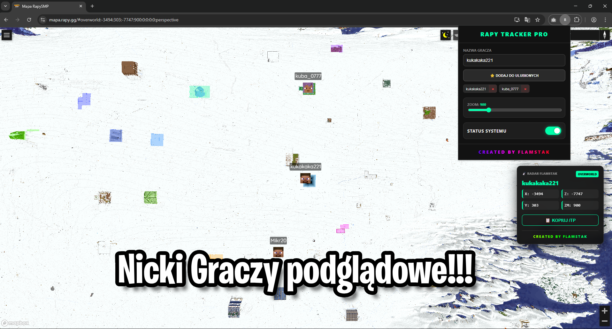

\# 📡 Rapy Tracker: Flamstak Edition v2.1

!\[Version](https://img.shields.io/badge/version-2.1-00ffaa?style=for-the-badge) !\[Author](https://img.shields.io/badge/created\_by-Flamstak-ff0000?style=for-the-badge) !\[Game](https://img.shields.io/badge/Minecraft-Rapy.gg-blue?style=for-the-badge)

> \*\*Zdominuj mapę. Nie zgub celu. Bądź zawsze krok przed innymi.\*\*

> Rapy Tracker to Twoje ostateczne centrum dowodzenia na mapie `mapa.rapy.gg`.

---

&nbsp; 

---

\## 🔥 Dlaczego musisz to mieć?

To nie jest zwykła wtyczka. To \*\*taktyczny HUD\*\*, który nakłada się bezpośrednio na mapę gry, dając Ci przewagę, której potrzebujesz. Koniec z ręcznym przepisywaniem koordynatów i szukaniem graczy w gąszczu znaczników.

\### ✨ Główne funkcje:

\* \*\*🕵️‍♂️ Radar HUD w Czasie Rzeczywistym\*\*

&nbsp;   Pływające okienko (HUD) na mapie, które pokazuje dokładną pozycję śledzonego gracza (X, Y, Z) oraz wymiar (Overworld/Nether/End). Możesz je dowolnie przesuwać po ekranie!

\* \*\*📋 System "One-Click /TP"\*\*

&nbsp;   Widzisz cel? Klikasz jeden przycisk w HUDzie, a gotowa komenda `/tp X Y Z` ląduje w Twoim schowku. Wklejasz do gry i jesteś na miejscu.

\* \*\*⭐ Lista Ulubionych\*\*

&nbsp;   Masz stałych wrogów lub sojuszników? Dodaj ich do listy ulubionych w panelu sterowania, aby przełączać się między nimi jednym kliknięciem.

\* \*\*🎨 Design Neon \& RGB\*\*

&nbsp;   Estetyczny, ciemny motyw z neonowymi akcentami (`#00ffaa`) i animowanym podpisem RGB. Wygląda profesjonalnie i jest czytelny.

\* \*\*🔄 Auto-Focus \& Zoom\*\*

&nbsp;   Wtyczka automatycznie centruje mapę na graczu i utrzymuje wybrany poziom przybliżenia, nawet gdy cel się porusza.

---

\## 🛠️ Instalacja

Wtyczka działa na przeglądarkach opartych na Chromium (Chrome, Edge, Opera, Brave).

1\.  \*\*Pobierz pliki\*\* tego repozytorium na dysk (rozpakuj, jeśli są w ZIP).

2\.  Otwórz przeglądarkę i wpisz w pasek adresu: `chrome://extensions`.

3\.  W prawym górnym rogu włącz \*\*Tryb dewelopera\*\* (Developer mode).

4\.  Kliknij przycisk \*\*Załaduj rozpakowane\*\* (Load unpacked).

5\.  Wybierz folder, w którym znajdują się pliki wtyczki (`manifest.json`, `bridge.js` itd.).

6\.  Gotowe! Ikona \*\*Rapy Tracker\*\* pojawi się na pasku rozszerzeń.

---

\## 🎮 Jak używać?

1\.  Wejdź na stronę \[mapa.rapy.gg](https://mapa.rapy.gg).

2\.  Kliknij ikonę wtyczki na pasku przeglądarki.

3\.  Wpisz \*\*Nick gracza\*\*, którego chcesz namierzyć (lub wybierz z ulubionych).

4\.  Ustaw suwak \*\*Status Systemu\*\* na włączony (zielony).

5\.  Na mapie pojawi się \*\*HUD\*\*:

&nbsp;   \* Przeciągnij go w wygodne miejsce myszką.

&nbsp;   \* Obserwuj koordynaty i wymiar.

&nbsp;   \* Kliknij przycisk \*\*KOPIUJ /TP\*\*, aby skopiować gotową komendę teleportacji.

---

\## 📸 Rzut oka na technologie

Wtyczka korzysta z zaawansowanych mechanizmów dla zapewnienia płynności:

\* `bridge.js` - Most łączący ustawienia użytkownika ze stroną w czasie rzeczywistym.

\* `content.js` - Wstrzykuje interfejs HUD bezpośrednio w strukturę DOM mapy (Overlay).

\* `Secure Copy` - Specjalny algorytm zapewniający, że kopiowanie do schowka działa niezawodnie.

---

\### Created with ❤️ \& ⚡ by Flamstak

\*Niech koordynaty będą z Tobą.\*

